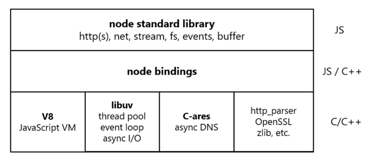
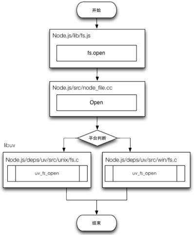

# Node 下的进程和线程 #
> Nodejs是单线程吗？
- JS Engine是单线程，但单线程无法利用多核CPU的优势，所以可以采用多进程 + 单线程 的模式。
- 开启多进程不是为了解决高并发，而是解决了单进程下CPU利用率不足的情况。

> 开发过程中如何实现进程的守护？

Node.js 开发过程中，错误会引起整个应用退出，应用的健壮性值得考验，尤其是错误的异常抛出，以及进程守护是必须要做的。

> 怎么封装一个多进程架构？

> 在web服务器方面，Nginx也是采用事件驱动的，避免了多线程的线程创建，线程上下文切换的开销。Nginx采用C语言进行编写，做高性能web服务器。

## 进程创建 ##
常用函数 child_process.spawn， child_process.fork 和 child_process.exec 有什么区别：
- spawn适用于大量数据的返回，如图像处理，二进制数据的处理。spawn返回一个 **带有stdout和stderr流的对象**。
- exec适用于小数据量，maxBuffer 默认为 200k， 超出默认值将会导致程序崩溃。缓存子进程的输出，并将子进程的输出以回调函数参数的形式一次性返回。exec方法会从子进程中**返回一个完整的buffer。**
- fork是spawn的特殊形式，和spawn不同的是fork会 **在父子进程之间建立一个通信管道，用于进程间通信。**

spawn和exec只能父进程获得子进程的返回，但不能send message。

fork例子：
```
const http = require('http');
const fork = require('child_process').fork;

const server = http.createServer((req,res)=>{
  // 如果是耗时请求
  if(req.url === '/compute'){
    // 新建进程
    const newProcess = fork('./compute.js');
    // 向子进程发送数据
    newProcess.send('data');

    newProcess.on('message', data=>{
      res.end(data);
      newProcess.kill(); // 计算结束，删除子进程
    });

    newProcess.on('close', (code, signal)=>{
      // code 是退出码，signal是收到的信号
      newProcess.kill();
    });
  }
});

server.listen(3000, 'http://localhost', ()=>{
  // on connect
});
```

cluster模块调用fork方法来创建子进程，该方法与child_process中的fork是同一个方法。 cluster模块采用的是经典的主从模型，Cluster会创建一个master。由master进程来管理所有的子进程，主进程不负责具体的任务处理，主要工作是负责调度和管理。

cluster模块使用内置的负载均衡来更好地处理进程之间的压力，该负载均衡使用了Round-robin算法（也被称之为循环算法）。当使用Round-robin调度策略时，master accepts()所有传入的连接请求，然后将相应的TCP请求处理发送给选中的工作进程。

上述代码使用cluster的实现：

```
const http = require('http');
const cluster = require('cluster');
const cpus = require('os').cpus().length;

if(cluster.isMaster){
  console.log('Master proces id is',process.pid);
  // fork workers
  for(let i= 0;i<numCPUs;i++){
      cluster.fork();
  }
  cluster.on('exit',function(worker,code,signal){
      console.log('worker process died,id',worker.process.pid)
  });
} else {
  // Worker可以共享同一个TCP连接
  http.createServer(function(req,res){
      res.writeHead(200);
      res.end('hello word');
  }).listen(8000);
}
```

cluster 虽然简单但灵活性不如 child_process，一个主进程只能管理一组相同的工作进程。

## 多进程监听同一端口 疑问讲解 ##
如果多个Node进程监听同一个端口时，会出现 Error:listen EADDRIUNS的错误，而cluster模块为什么可以让多个子进程监听同一个端口呢?原因是**master进程内部启动了一个TCP服务器，而真正监听端口的只有这个服务器**，当来自前端的请求触发服务器的connection事件后，master会将对应的socket具柄发送给子进程。

## 进程间通信原理 ##
Node中实现IPC通道是依赖于libuv。windows下由命名管道(name pipe)实现，*nix系统则采用Unix Domain Socket实现。


IPC通道是如何创建的：
- 父进程在实际创建子进程之前，会创建 IPC通道 并监听他，然后才创建子进程，创建子进程时会通过环境变量（NODE_CHANNEL_FD）告知子进程 IPC通道 的文件描述符。 子进程在启动过程中，根据文件描述符去连接这个已存在的IPC通道，从而建立连接。


## nodejs 句柄传递 ##
子进程对象send()方法可以发送的句柄类型

- net.Socket TCP套接字
- net.Server TCP服务器，任意建立在TCP服务上的应用层服务都可以享受它带来的好处
- net.Native C++层面的TCP套接字或IPC管道
- dgram.Socket UDP套接字
- dgram.Native C++层面的UDP套接字

send() 在消息发送到IPC管道前，实际将消息封装成2个对象


## Nodejs 线程 ##
Node 中最核心的是 v8 引擎，在 Node 启动后，会创建 v8 的实例，这个实例是多线程的。

- 主线程：编译、执行代码。
- 编译/优化线程：在主线程执行的时候，可以优化代码。
- 分析器线程：记录分析代码运行时间，为 Crankshaft 优化代码执行提供依据。
- 垃圾回收的几个线程。

无论是 Node 还是浏览器都是多线程的，因为libuv中有线程池的概念存在，libuv会通过类似线程池的实现来模拟不同操作系统的异步调用，这对开发者来说是不可见的。

## 某些异步 IO 会占用额外的线程 ##
还是上面那个例子，我们在定时器执行的同时，去读一个文件：
```
const fs = require('fs')
setInterval(() => {
    console.log(new Date().getTime())
}, 3000)

fs.readFile('./index.html', () => {})
```

线程数量变成了 11 个，这是因为在 Node 中有一些 IO 操作（DNS，FS）和一些 CPU 密集计算（Zlib，Crypto）会启用 Node 的线程池，而线程池默认大小为 4。
我们可以手动更改线程池默认大小：

```
process.env.UV_THREADPOOL_SIZE = 64
```

Nodejs 内部：


调用fs包的流程大致如下: 


从JavaScript调用Node的核心模块，核心模块调用C++内建模块，内建模块通过 libuv进行系统调用，这是Node里经典的调用方式。总体来说，我们在 Javascript 中调用的方法，最终都会通过node-bindings 传递到 C/C++ 层面，最终由他们来执行真正的操作。Node.js 即这样与操作系统进行互动。

