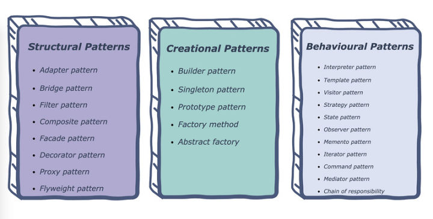

# JS与设计模式 #
## JS是面向对象语言吗？ ##
js不是一个严格的面向对象语言，说javascript是一种基于对象的语言应该更正确些。js将其他语言创建的复杂对象统一起来，形成强大的对象系统。是prototype-based的（**基于原型的面向对象**）。

## 前端需要面向对象吗？ ##
ES6以前，很多第三方类库不是用Class的方式提供的。项目中如果使用了这些库，会导致代码风格不统一。如
```
const obj = thirdParty.create({
  param1, param2 ……
});

obj.prototype.newFunction = function(){ ... }
// 导致对象和对象方法不能同时创建。
```
如果是面向对象语言，我们可以继承这个类，然后通过方法的重载或覆盖来重写关键方法。JS同理。

## 设计模式 ##
23种设计模式（工厂，单例，原型，策略，模板，组合，门面，命令……），可分为3类（创建型，结构型，行为型），设计模式的基石就是对象，那么设计模式解决了项目的什么痛点？设计模式都是为了：**找到变化，封装变化**

1. 结构型模式（Structural Patterns）： 通过识别系统中组件间的简单关系来简化系统的设计。
2. 创建型模式（Creational Patterns）： 处理对象的创建，根据实际情况使用合适的方式创建对象。常规的对象创建方式可能会导致设计上的问题，或增加设计的复杂度。创建型模式通过以某种方式控制对象的创建来解决问题。
3. 行为型模式（Behavioral Patterns）： 用于识别对象之间常见的 **交互** 模式并加以实现，如此，增加了这些交互的灵活性。



## 结构型模式什么在变化 ##
对象之间的关系有依赖，泛化，组合，聚合。但结构关系就2种：线性的和非线性的。线性关系比较简单，就是一对一的关联关系，非线性关系分成两种：树型关系和图型关系。关系结构有变化，意味着依赖发生了变化，比如线性关系中的变化，A依赖的B发生了变化，此时B变化了就会影响A，怎么做到B的变化不影响A就是要考虑的问题。

### 应对线性变化 ###
如上面所讲，如果B发生了变化，由于A依赖B，则对象A也要改变化，如何减少对A的影响呢？

这里有两种方法：一种是通过 **增加适配** 来解决，另一种是通过 **代理** 来解决。这两种方法的要点都是一个对象不与变化的对象直接关联，不管是适配还是代理，都是引入了第三方来与B关联，第三方负责与B进行交互，B对A是没有感知的。有的人马上发现了一个问题，这不是把问题转移到第三方上了吗？乍一看，还真是这么回事，如果我们再发散思考，如果除了A要与B关系，还有E、F……，如果B一改就关联的所有对象就要变化，这种代价就比较高，如果只与第三方关系，只用改一个地方，成本要少得多。

### 应对非线性变化 ###
非线性关系比线性关系要复杂，常见也有两种方法：一种是通过 **注册机制**，另一种通过 **抽象层屏蔽复杂性**。当一个对象包含多个对象时，如果直接去管理，需要承担的职责太多，通过注册机制就比较好解决，增加一个对象，是通过注册机制主动告知对象。另外一种方法就是通过抽象层屏蔽复杂性，比如门面模式，在门面内把所有的复杂度都规避，对外提供简洁的接口。

https://zhuanlan.zhihu.com/p/365371763

## 常用模式例子 ##
## 1. 观察者模式【行为型模式】： ##
被观察对象（subject）维护一组观察者（observer）。如多个listener同时监听一个DOM的变化。
```
target.addEventListener(type, listener [, options]);
// target 就是Subject，listener就是Observer。
```
Subject对象一般需要实现以下API：
- subscribe(): 接收一个观察者observer对象，使其订阅自己
- unsubscribe(): 接收一个观察者observer对象，使其取消订阅自己
- fire(): 触发事件，通知到所有观察者
```
// 被观察者
function Subject() {
  this.observers = [];
}

Subject.prototype = {
  // 订阅
  subscribe: function (observer) {
    this.observers.push(observer);
  },
  // 取消订阅
  unsubscribe: function (observerToRemove) {
    this.observers = this.observers.filter(observer => {
      return observer !== observerToRemove;
    })
  },
  // 事件触发
  fire: function () {
    this.observers.forEach(observer => {
      observer.call();
    });
  }
}
```

## 观察者模式和发布-订阅模式的区别 ##
在发布-订阅模式，消息的发送方叫发布者，消息不会直接发送给特定的接受者。而观察者会。即发布者和订阅者不知道对方的存在，他们之间存在一个第三方组件，叫**信息中介**，它将订阅者和发布者串联起来，**过滤和分配所有输入的消息**。

**发布-订阅模式用来处理不同系统组件的信息交流，组件间不知道对方的存在**


**总结：**
- 在观察者模式中，观察者是知道Subject的，Subject一直保持对观察者进行记录。然而，在发布订阅模式中，发布者和订阅者不知道对方的存在。它们只有通过消息代理进行通信。
- 在发布订阅模式中，组件是松散耦合的，正好和观察者模式相反。
- 观察者模式大多数时候是同步的，比如当事件触发，Subject就会去调用观察者的方法。而发布-订阅模式大多数时候是异步的（使用消息队列）。
- 观察者 模式需要在单个应用程序地址空间中实现，而发布-订阅更像交叉应用模式。

尽管它们之间有区别，但有些人可能会说发布-订阅模式是观察者模式的变异，因为它们概念上是相似的。


## 2. 装饰器模式： ##
前端中的HOC，为组件添加一个wrapper。达到功能增强。
## 3. 适配器模式： ##
后端返回数据和前端数据的map。避免后端返回改变时，要修改相应的前端页面。
## 4. 外观/门面模式： ##
不同浏览器的兼容，如addEventListener在Chrome和IE中是不同的函数。可以对事件处理进行封装。通常是为子系统中一组接口提供一个统一的高层接口，使子系统更容易被调用。
## 5. 代理模式： ##
拦截器，当访问一个对象代价太高时（如太占内存，初始化时间太长等），或者 **需要额外的处理逻辑又不修改对象本身时** 可以使用Proxy。具体是
```
1. 增加对一个对象的访问控制。
2. 访问一个对象过程中需要增加额外的逻辑。
```
实现代理模式要三部分：

1. Real Subject： 真实对象
2. Proxy： 代理对象
3. Subject接口： Real Subject和Proxy都要实现的接口。
例如一个股票价格查询接口，接口延时2s。

```
function StockPriceAPI() {
  // Subject Interface实现
  this.getValue = function (stock, callback) {
    console.log('Calling external API ... ');
    setTimeout(() => {
      switch (stock) {
        case 'GOOGL':
          callback('$1265.23');
          break;
        case 'AAPL':
          callback('$287.05');
          break;
        case 'MSFT':
          callback('$173.70');
          break;
        default:
          callback('');
      }
    }, 2000);
  }
}
```

我们不希望每次都去请求远程接口，而是增加缓存机制，当有缓存的时候就直接从缓存中获取，否则再去请求远程接口。我们可以通过一个proxy来实现：
```
function StockPriceAPIProxy() {
  // 缓存对象
  this.cache = {};
  // 真实API对象
  this.realAPI = new StockPriceAPI();
  // Subject Interface实现
  this.getValue = function (stock, callback) {
    const cachedPrice = this.cache[stock];
    if (cachedPrice) {
      console.log('Got price from cache');
      callback(cachedPrice);
    } else {
      this.realAPI.getValue(stock, (price) => {
        this.cache[stock] = price;
        callback(price);
      });
    }
  }
}
```

6. 单例模式：Class的实例数最多为1. 当需要一个对象去贯穿整个系统执行某些任务时，会用单例模式。除此以外，尽量避免使用单例模式，因为单例会引入**全局状态**，一个健康的系统应避免引入过多的全局状态。

单例需要：隐藏Class的构造函数，暴露一个getInstance() 方法来创建/获取唯一的实例。
```
// 使用立刻执行函数，保证只能执行一次
const FooServiceSingleton = (function (){
  // 隐藏的class构造函数。
  function FooService(){}
  let fooService;

  // 返回只有getInstance的对象。
  return {
    // JS 是单线程，所以getInstance不用考虑被同时调用
    getInstance：function(){
      if(!fooService){
        fooService = new FooService();
      }
      return fooService;
    }
  }
})();

const fooService1 = FooServiceSingleton.getInstance();
const fooService2 = FooServiceSingleton.getInstance();

console.log(fooService1 === fooService2); // true
```

## 行为型模式 ##
1. 策略模式：对象有某个行为，但是在不同的场景中，该行为有不同的实现算法。最常见的场景：**登录鉴权**。鉴权算法取决于用户的登录方式是手机，邮箱，第三方微信登录等等。Passport.js API 就应用了策略模式。
```
/**
 * 登录控制器
 */
function LoginController() {
  this.strategy = undefined;
  this.setStrategy = function (strategy) {
    this.strategy = strategy;
    this.login = this.strategy.login;
  }
}

/**
 * 用户名、密码登录策略
 */
function LocalStragegy() {
  this.login = ({ username, password }) => {
    console.log(username, password);
    // authenticating with username and password...
  }
}

/**
 * 手机号、验证码登录策略
 */
function PhoneStragety() {
  this.login = ({ phone, verifyCode }) => {
    console.log(phone, verifyCode);
    // authenticating with hone and verifyCode...
  }
}

/**
 * 第三方社交登录策略
 */
function SocialStragety() {
  this.login = ({ id, secret }) => {
    console.log(id, secret);
    // authenticating with id and secret...
  }
}

const loginController = new LoginController();

// 调用用户名、密码登录接口，使用LocalStrategy
app.use('/login/local', function (req, res) {
  loginController.setStrategy(new LocalStragegy());
  loginController.login(req.body);
});

// 调用手机、验证码登录接口，使用PhoneStrategy
app.use('/login/phone', function (req, res) {
  loginController.setStrategy(new PhoneStragety());
  loginController.login(req.body);
});

// 调用社交登录接口，使用SocialStrategy
app.use('/login/social', function (req, res) {
  loginController.setStrategy(new SocialStragety());
  loginController.login(req.body);
});
```
策略模式有以下优势：

  1. 方便在运行时切换算法和策略
  2. 代码更简洁，避免使用大量的条件判断
  3. 关注分离，每个strategy类控制自己的算法逻辑，strategy和其使用者之间也相互独立.

## 2. 迭代器模式： ##
迭代器用于遍历容器（集合）并访问容器中的元素，而且无论容器的数据结构是什么（Array，Set，Map），迭代器的接口都是一样的。
```
const item = [1, 'red', false, 3.14];

function Iterator(items) {
  this.items = items;
  this.index = 0;
}

Iterator.prototype = {
  hasNext: function () {
    return this.index < this.items.length;
  },
  next: function () {
    return this.items[this.index++];
  }
}

// 验证
const iterator = new Iterator(item);

while(iterator.hasNext()){
  console.log(iterator.next());
}
```
ES6提供了更简单的迭代循环语法 ``for...of``，使用该语法的前提是操作对象需要实现 可迭代协议（The iterable protocol），简单说就是该对象有个Key为 ``Symbol.iterator`` 的方法，该方法返回一个iterator对象。

例如实现一个 ``Range``类用于在某个区间进行迭代：
```
function Range(start, end) {
  return {
    [Symbol.iterator]: function () {
      return {
        next() {
          if (start < end) {
            return { value: start++, done: false };
          }
          return { done: true, value: end };
        }
      }
    }
  }
}
```

## 中介者模式 ##
在中介者模式中，中介者（Mediator）包装了一系列对象相互作用的方式，使得这些对象不必直接相互作用，而是由中介者协调它们之间的交互，从而使它们可以松散偶合。一般应用于聊天室。两用户间不能直接连接，而是通过聊天室进行转发。
```
// 聊天室（中介者类似于注册）
function Chatroom() {
  this.members = {};
}

Chatroom.prototype = {
  // 增加成员
  addMember: function (member) {
    this.members[member.name] = member;
    member.chatroom = this;
  },
  // 发送消息
  send: function (message, fromMember, toMember) {
    toMember.receive(message, fromMember);
  }
}

// 聊天成员
function Member(name) {
  this.name = name;
  this.chatroom = null;
}

Member.prototype = {
  // 发送消息
  send: function (message, toMember) {
    this.chatroom.send(message, this, toMember);
  },
  // 接收消息
  receive: function (message, fromMember) {
    console.log(`${fromMember.name} to ${this.name}: ${message}`);
  }
}

// 验证
const chatroom = new Chatroom();
const bruce = new Member('bruce');
const frank = new Member('frank');

chatroom.addMember(bruce);
chatroom.addMember(frank);

bruce.send('Hey frank', frank);

```