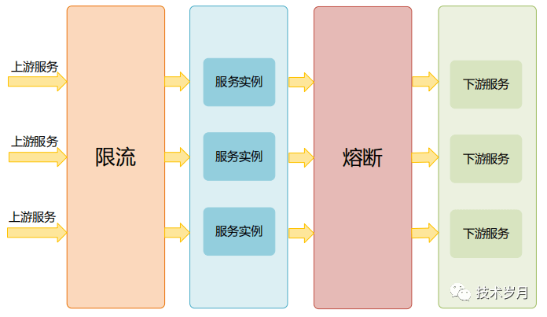
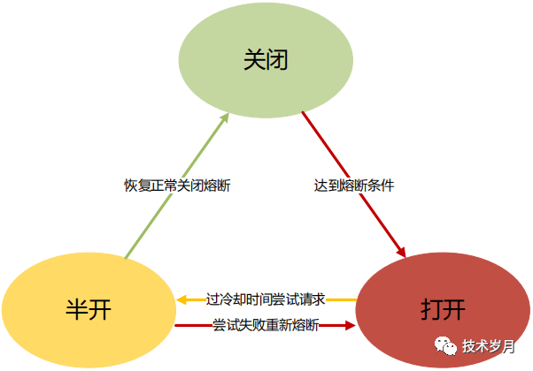
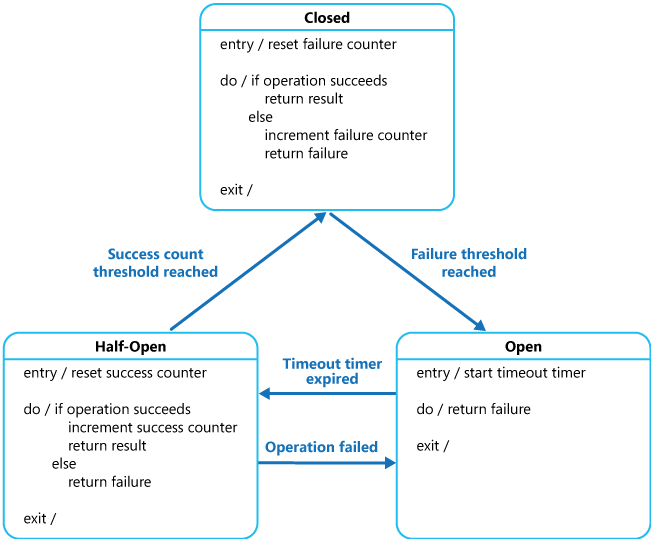

# 断路器（熔断器） #
是微服务架构中的一种设计模式，在微服务架构中，经常会碰到服务超时或通讯失败的问题，由于服务间层次依赖，很可能由于某个服务的问题，不合理的重试和超时设置，导致问题层层传递，引发雪崩现象，而限流和熔断是解决这个问题的重要解决方式。

如下图所示，当 “服务C” 出现问题时，可能是宕机，上线出 bug，流量过大或缓存穿透数据库压垮服务，这时“服务 C”响应就会出问题，而“服务 B”由于拿不到响应结果又会不断重试进一步压垮“服务 C”，同时“服务 B”同步调用也会有大量等待线程，出现资源耗尽，导致“服务 B”变得不可用，进而影响到“服务 A”，形成雪崩效应。


为了解决雪崩效应，要建立有效的 服务容错机制，一方面服务要做到冗余，建立 集群，依托 负载均衡机制和 重试机制，保障服务可用性。除了集群容错外，对服务的熔断和限流也是必要的措施，虽然两者经常相伴出现，却是不同的保护机制。限流是防止上游服务调用量过大导致当前服务被压垮，熔断是预防下游服务出现故障时阻断对下游的调用。



熔断器涉及 三种状态和 四种状态转移



```
package com.lpf.熔断器;

public class Main {
	public static void main(String[] args) {
		Context context = new Context();
		context.state = new CloseState();

		context.switchState();
		context.switchState();
		context.switchState();
		context.switchState();
		context.switchState();
	}
}

/**
 * 状态上下文
 */
class Context {
	public State state;

	void switchState() {
		state.switchState(this);
	}
}

/**
 * 状态的抽象
 */
interface State {
	void switchState(Context context);
}

/**
 * 开状态
 **/
class OpenState implements State {

	public void switchState(Context context) {
		System.out.println("当前状态：开");
		context.state = new CloseState();
	}
}

/**
 * 关状态
 **/
class CloseState implements State {

	public void switchState(Context context) {
		System.out.println("当前状态：关");
		context.state = new OpenState();
	}
}
```
在每一种状态下，context不必关心每种状态下的行为，交给每种状态自己处理。断路器本身就是一个状态机。

- 关闭状态：熔断器的初始化状态，该状态下允许请求通过。当失败超过阀值，转入打开状态；
- 打开状态：熔断状态，该状态下不允许请求通过，当进入该状态经过一段时间，进入半开状态；
- 半开状态：在半开状态期间，允许部分请求通过，在半开期间，观察失败状态是否超过阀值。如果没有超过进入关闭状态，如果超过了进入打开状态。如此往复。

例子：

熔断器对外接口：
```
/**
 * 熔断器接口
 */
public interface CircuitBreaker {
    /**
     * 重置熔断器
     */
    void reset();

    /**
     * 是否允许通过熔断器
     */
    boolean canPassCheck();

    /**
     * 统计失败次数
     */
    void countFailNum();
}
```

熔断器状态对外接口：
```
/**
 * 熔断器状态
 */
public interface CBState {
    /**
     * 获取当前状态名称
     */
    String getStateName();

    /**
     * 检查以及校验当前状态是否需要扭转
     */
    void checkAndSwitchState(AbstractCircuitBreaker cb);

    /**
     * 是否允许通过熔断器
     */
    boolean canPassCheck(AbstractCircuitBreaker cb);

    /**
     * 统计失败次数
     */
    void countFailNum(AbstractCircuitBreaker cb);
}
```

三种状态：
```
import java.util.concurrent.atomic.AtomicInteger;

/**
 * 熔断器-关闭状态
 */
public class CloseCBState implements CBState {

    /**
     * 进入当前状态的初始化时间
     */
    private long stateTime = System.currentTimeMillis();

    /**
     * 关闭状态，失败计数器，以及失败计数器初始化时间
     */
    private AtomicInteger failNum = new AtomicInteger(0);
    private long failNumClearTime = System.currentTimeMillis();

    public String getStateName() {
        // 获取当前状态名称
        return this.getClass().getSimpleName();
    }

    public void checkAndSwitchState(AbstractCircuitBreaker cb) {
        // 阀值判断，如果失败到达阀值，切换状态到打开状态
        long maxFailNum = Long.valueOf(cb.thresholdFailRateForClose.split("/")[0]);
        if (failNum.get() >= maxFailNum) {
            cb.setState(new OpenCBState());
        }
    }

    public boolean canPassCheck(AbstractCircuitBreaker cb) {
        // 关闭状态，请求都应该允许通过
        return true;
    }

    public void countFailNum(AbstractCircuitBreaker cb) {
        // 检查计数器是否过期了，否则重新计数
        long period = Long.valueOf(cb.thresholdFailRateForClose.split("/")[1]) * 1000;
        long now = System.currentTimeMillis();
        if (failNumClearTime + period <= now) {
            failNum.set(0);
        }
        // 失败计数
        failNum.incrementAndGet();

        // 检查是否切换状态
        checkAndSwitchState(cb);
    }
}
```

```
/**
 * 熔断器-打开状态
 */
public class OpenCBState implements CBState {
	/**
	 * 进入当前状态的初始化时间
	 */
	private long stateTime = System.currentTimeMillis();

	public String getStateName() {
		// 获取当前状态名称
		return this.getClass().getSimpleName();
	}

	public void checkAndSwitchState(AbstractCircuitBreaker cb) {
		// 打开状态，检查等待时间是否已到，如果到了就切换到半开状态
		long now = System.currentTimeMillis();
		long idleTime = cb.thresholdIdleTimeForOpen * 1000L;
		if (stateTime + idleTime <= now) {
			cb.setState(new HalfOpenCBState());
		}
	}

	public boolean canPassCheck(AbstractCircuitBreaker cb) {
		// 检测状态
		checkAndSwitchState(cb);
		return false;
	}

	public void countFailNum(AbstractCircuitBreaker cb) {
		// nothing
	}
}
```

```
import java.util.concurrent.atomic.AtomicInteger;

/**
 * 熔断器-半开状态
 */
public class HalfOpenCBState implements CBState {

	/**
	 * 进入当前状态的初始化时间
	 */
	private long stateTime = System.currentTimeMillis();

	/**
	 * 半开状态，失败计数器
	 */
	private AtomicInteger failNum = new AtomicInteger(0);

	/**
	 * 半开状态，允许通过的计数器
	 */
	private AtomicInteger passNum = new AtomicInteger(0);

	public String getStateName() {
		// 获取当前状态名称
		return this.getClass().getSimpleName();
	}

	public void checkAndSwitchState(AbstractCircuitBreaker cb) {
		// 判断半开时间是否结束
		long idleTime = Long.valueOf(cb.thresholdPassRateForHalfOpen.split("/")[1]) * 1000L;
		long now = System.currentTimeMillis();
		if (stateTime + idleTime <= now) {
			// 如果半开状态已结束，失败次数是否超过了阀值
			int maxFailNum = cb.thresholdFailNumForHalfOpen;
			if (failNum.get() >= maxFailNum) {
				// 失败超过阀值，认为服务没有恢复，重新进入熔断打开状态
				cb.setState(new OpenCBState());
			} else {
				// 没超过，认为服务恢复，进入熔断关闭状态
				cb.setState(new CloseCBState());
			}
		}
	}

	public boolean canPassCheck(AbstractCircuitBreaker cb) {
		// 检查是否切换状态
		checkAndSwitchState(cb);

		// 超过了阀值，不再放量
		int maxPassNum = Integer.valueOf(cb.thresholdPassRateForHalfOpen.split("/")[0]);
		if (passNum.get() > maxPassNum) {
			return false;
		}
		// 检测是否超过了阀值
		if (passNum.incrementAndGet() <= maxPassNum) {
			return true;
		}
		return false;
	}

	public void countFailNum(AbstractCircuitBreaker cb) {
		// 失败计数
		failNum.incrementAndGet();

		// 检查是否切换状态
		checkAndSwitchState(cb);
	}
}
```

```
import java.util.concurrent.atomic.AtomicInteger;

/**
 * 熔断器-半开状态
 */
public class HalfOpenCBState implements CBState {

	/**
	 * 进入当前状态的初始化时间
	 */
	private long stateTime = System.currentTimeMillis();

	/**
	 * 半开状态，失败计数器
	 */
	private AtomicInteger failNum = new AtomicInteger(0);

	/**
	 * 半开状态，允许通过的计数器
	 */
	private AtomicInteger passNum = new AtomicInteger(0);

	public String getStateName() {
		// 获取当前状态名称
		return this.getClass().getSimpleName();
	}

	public void checkAndSwitchState(AbstractCircuitBreaker cb) {
		// 判断半开时间是否结束
		long idleTime = Long.valueOf(cb.thresholdPassRateForHalfOpen.split("/")[1]) * 1000L;
		long now = System.currentTimeMillis();
		if (stateTime + idleTime <= now) {
			// 如果半开状态已结束，失败次数是否超过了阀值
			int maxFailNum = cb.thresholdFailNumForHalfOpen;
			if (failNum.get() >= maxFailNum) {
				// 失败超过阀值，认为服务没有恢复，重新进入熔断打开状态
				cb.setState(new OpenCBState());
			} else {
				// 没超过，认为服务恢复，进入熔断关闭状态
				cb.setState(new CloseCBState());
			}
		}
	}

	public boolean canPassCheck(AbstractCircuitBreaker cb) {
		// 检查是否切换状态
		checkAndSwitchState(cb);

		// 超过了阀值，不再放量
		int maxPassNum = Integer.valueOf(cb.thresholdPassRateForHalfOpen.split("/")[0]);
		if (passNum.get() > maxPassNum) {
			return false;
		}
		// 检测是否超过了阀值
		if (passNum.incrementAndGet() <= maxPassNum) {
			return true;
		}
		return false;
	}

	public void countFailNum(AbstractCircuitBreaker cb) {
		// 失败计数
		failNum.incrementAndGet();

		// 检查是否切换状态
		checkAndSwitchState(cb);
	}
}
```

```
/**
 * 基础熔断器
 */
public abstract class AbstractCircuitBreaker implements CircuitBreaker {
	/**
	 * 熔断器当前状态
	 */
	private volatile CBState state = new CloseCBState();

	/**
	 * 在熔断器关闭的情况下，在多少秒内失败多少次进入，熔断打开状态（默认10分钟内，失败10次进入打开状态）
	 */
	public String thresholdFailRateForClose = "10/600";

	/**
	 * 在熔断器打开的情况下，熔断多少秒进入半开状态，（默认熔断30分钟）
	 */
	public int thresholdIdleTimeForOpen = 1800;

	/**
	 * 在熔断器半开的情况下, 在多少秒内放多少次请求，去试探(默认10分钟内，放10次请求)
	 */
	public String thresholdPassRateForHalfOpen = "10/600";

	/**
	 * 在熔断器半开的情况下, 试探期间，如果有超过多少次失败的，重新进入熔断打开状态，否者进入熔断关闭状态。
	 */
	public int thresholdFailNumForHalfOpen = 1;

	public CBState getState() {
		return state;
	}

	public void setState(CBState state) {
		// 当前状态不能切换为当前状态
		CBState currentState = getState();
		if (currentState.getStateName().equals(state.getStateName())) {
			return;
		}

		// 多线程环境加锁
		synchronized (this) {
			// 二次判断
			currentState = getState();
			if (currentState.getStateName().equals(state.getStateName())) {
				return;
			}

			// 更新状态
			this.state = state;
			System.out.println("熔断器状态转移：" + currentState.getStateName() + "->" + state.getStateName());
		}
	}
}

/**
 * 本地熔断器(把它当成了工厂了)
 */
public class LocalCircuitBreaker extends AbstractCircuitBreaker {

	public LocalCircuitBreaker(String failRateForClose, int idleTimeForOpen, String passRateForHalfOpen, int failNumForHalfOpen) {
		this.thresholdFailRateForClose = failRateForClose;
		this.thresholdIdleTimeForOpen = idleTimeForOpen;
		this.thresholdPassRateForHalfOpen = passRateForHalfOpen;
		this.thresholdFailNumForHalfOpen = failNumForHalfOpen;
	}

	public void reset() {
		this.setState(new CloseCBState());
	}

	public boolean canPassCheck() {
		return getState().canPassCheck(this);
	}

	public void countFailNum() {
		getState().countFailNum(this);
	}
}

```

https://blog.csdn.net/liupeifeng3514/article/details/82852187