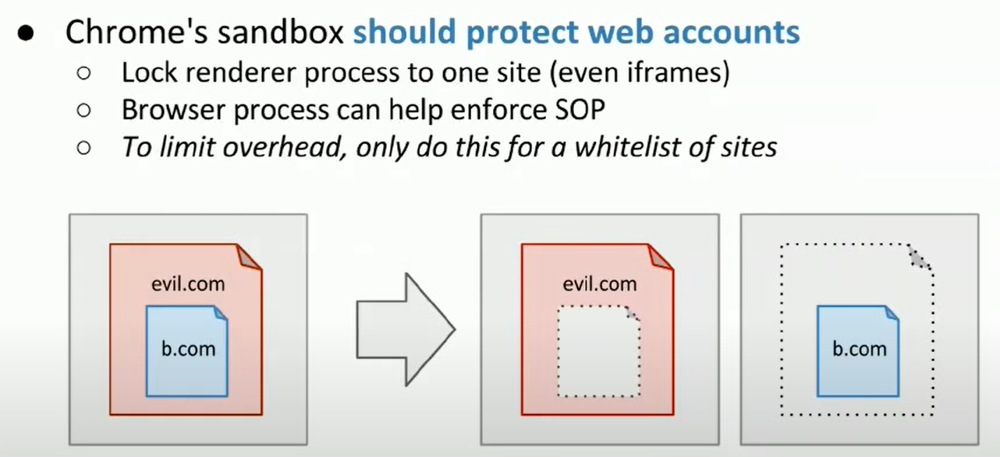
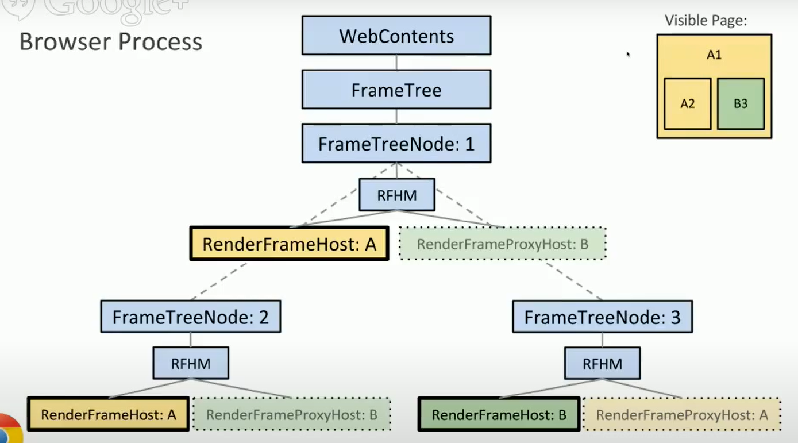
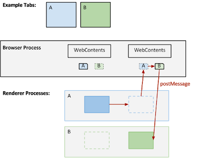

# [site isolation](https://www.chromium.org/developers/design-documents/site-isolation) #

http://www.chromium.org/developers/design-documents/oop-iframes#TOC-Project-Resources
http://www.chromium.org/developers/design-documents/process-models

## site isolation 与 sandbox 区别 ##
sandbox 主要保护本地主机，如render失败的时候browser不会崩溃。但不能保护web账户的安全，web renderer可以访问所有site的资源，容易被恶意site利用。

现要变成：

改变之后每个frame是一个基础单元，而不是一个page。同源的frame跑在同一个render process下，每个render process还有一个proxy，支持postMessage。在Out-of-Process iframes (OOPIFs)场景下：

