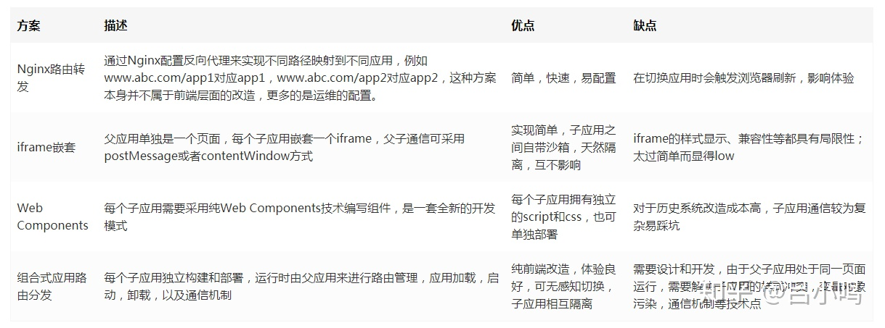
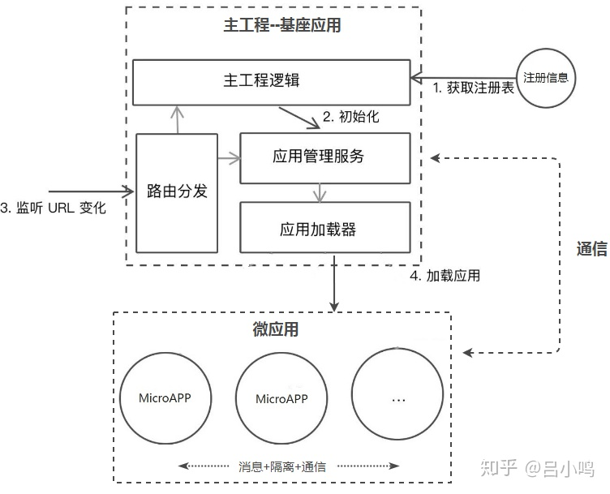
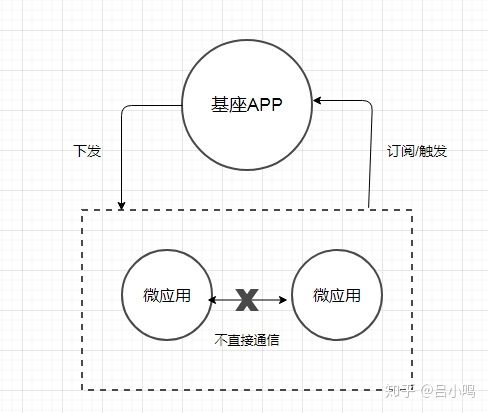

# 微前端 #
类似于后端的微服务，将前端应用拆分为多个小型应用，使其独立运行，独立开发，独立部署。

## 微前端的实现方案 ##
实现思想就是拆解和整合，通常是一个父应用加上一些子应用，使用类似Nginx配置不同应用的转发。或者采用iframe来将多个应用整合到一起。具体如下表：

## 组合式应用路由方案 ##
该方案的核心是“主从”思想，即包括一个基座（MainApp）应用和若干个微（MicroApp）应用，基座应用大多数是一个前端SPA项目，主要负责应用注册，路由映射，消息下发等，而微应用是独立前端项目，这些项目不限于采用React，Vue，Angular或者JQuery开发，每个微应用注册到基座应用中，由基座进行管理，但是如果脱离基座也是可以单独访问，基本的流程如下图所示：

简单描述下就是基座应用中有一些菜单项，点击每个菜单项可以展示对应的微应用，这些应用的切换是纯前端无感知的，所以，基于目前的方案来说，一个微前端的基座框架需要解决以下问题：

1. 路由切换的分发问题。
2. 主微应用的隔离问题。
3. 通信问题。

## 微前端路由的分发 ##
1. 主应用首先要能先拉取微应用的页面内容，需要**远程拉取机制**。通常是通过fetch API获得微应用的HTML，然后将微应用的JavaScript和CSS进行抽离，采用eval方法来运行JavaScript，并将CSS和HTML内容append到基座应用中留给微应用的展示区域，当微应用切换走时，同步卸载这些内容，这就构成的当前应用的展示流程。
2. 这个流程里会涉及到CSS样式的污染以及JavaScript对全局对象的污染，需要对微应用隔离。

## 微前端的应用隔离 ##
- CSS隔离： 可以采用CSS Module或者命名空间的方式。给每个微应用模块以特定的前缀。可以采用webpack的postcss插件，在打包时添加特定的前缀。
- Js隔离： 沙箱机制

## 微前端消息通信 ##
通常采用发布订阅模式，在主应用中定义一系列事件，每个微应用分别注册事件，当事件触发时，使用主应用统一分发。

