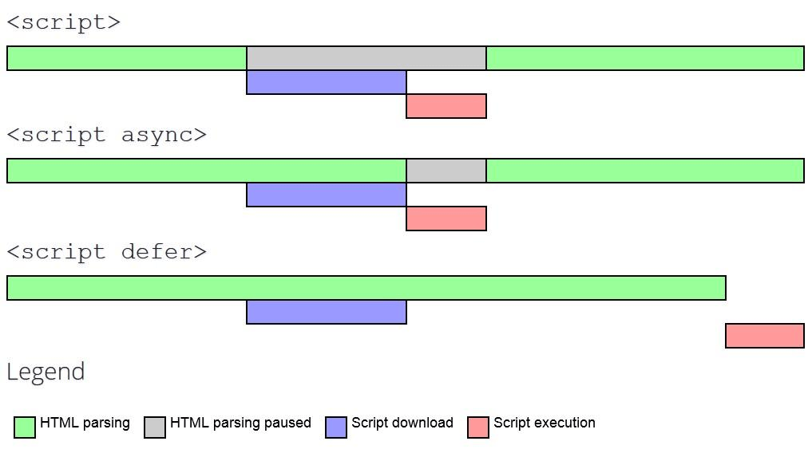

# 加载第三方JS #
页面加载速度变慢有可能是第三方脚本（第三方JavaScript通常指的是可以直接从第三方供应商嵌入到任何站点的脚本）：广告ads iframe，播放器video player embed，分析图表analytics & metrics，追踪器trackers，社交媒体按钮social-button， A/B testing scripts for experiment， Helper libraries（data formatting, animation, functional libraries） 等导致的。理想状态下，希望确保第三方脚本不会影响关键路径的渲染，但实际上很难避免。

第三方脚本可能导致：
- 性能问题
- 隐私问题
- 安全问题
- 他们可能是不可预测的，在你不知道的时候发生变化。

## 性能问题 ##
- 向多个服务器发送过多的网络请求。
- 发送大量的JS文件导致主进程繁忙，阻塞DOM构建，渲染。CPU密集型的脚本更会导致阻塞用户交互，电池耗尽。
- 发送大图片，没优化的视频，会消耗更多的带宽。
- 可能产生单点故障（single-point of failure）
- Http 缓存不足，迫使从网络获取资源
- 缺乏一定的服务器资源压缩
- A/B测试脚本也会阻塞内容的渲染。
- 使用已知对用户体验有害的遗留api（如document.write()）
- 包含多个第三方嵌入可能会导致多次引入多个框架和库，是一种浪费。
- 第三方脚本一般使用嵌入技术，如果服务器响应缓慢或者async或defer嵌入，会阻塞window.onload函数的调用。

衡量第三方脚本的工作流是：
1. 使用Network面板测量页面加载的时间。
 - 为了测量真实情况，推荐打开network throttle（网络节流）和CPU throttle（CPU节流）。
2. 阻塞那些你认为影响性能的第三方脚本（右键block this url or domain），刷新页面，重新计算页面加载时间。
3. 多次测量，取中间值。

## 使用长任务检测expensive iframe ##
为了real user monitoring，我们检测长任务，我们使用JS PerformanceObserver API。例子：

```
<script>
    const observer = new PerformanceObserver((list) => {

        for (const entry of list.getEntries()) {

            // Attribution entry including "containerSrc":"https://example.com"
            console.log(JSON.stringify(entry.attribution));

        }

    });

    observer.observe({ entryTypes: ['longtask'] });
</script>

<!-- Imagine this is an iframe with expensive long tasks -->
<iframe src="https://example.com"></iframe>
```

## 怎么高效加载第三方脚本 ##
- 使用async或defer加载脚本，避免阻塞DOM parse，除非脚本逻辑和渲染有关。
- 考虑自己host 脚本，如果第三方服务器过慢。
- 考虑去除脚本，如果没有明显的作用。
- 添加resource hint，如``<link rel=preconnect>`` 或者 ``<link rel=dns-prefetch>``，为托管第三方脚本的domain执行DNS查找。



使用async加载analytics类的脚本，越早执行越好。使用defer加载video player。
